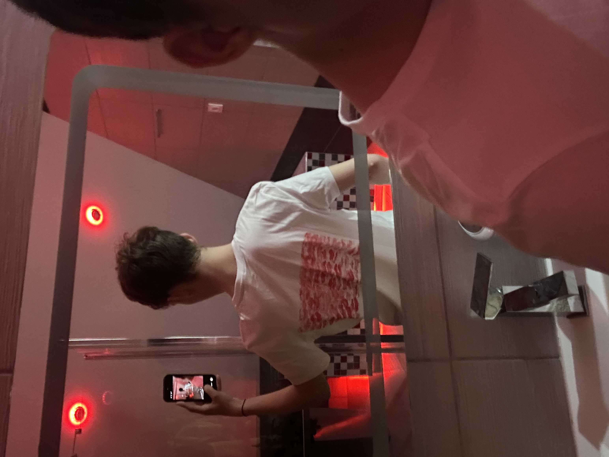
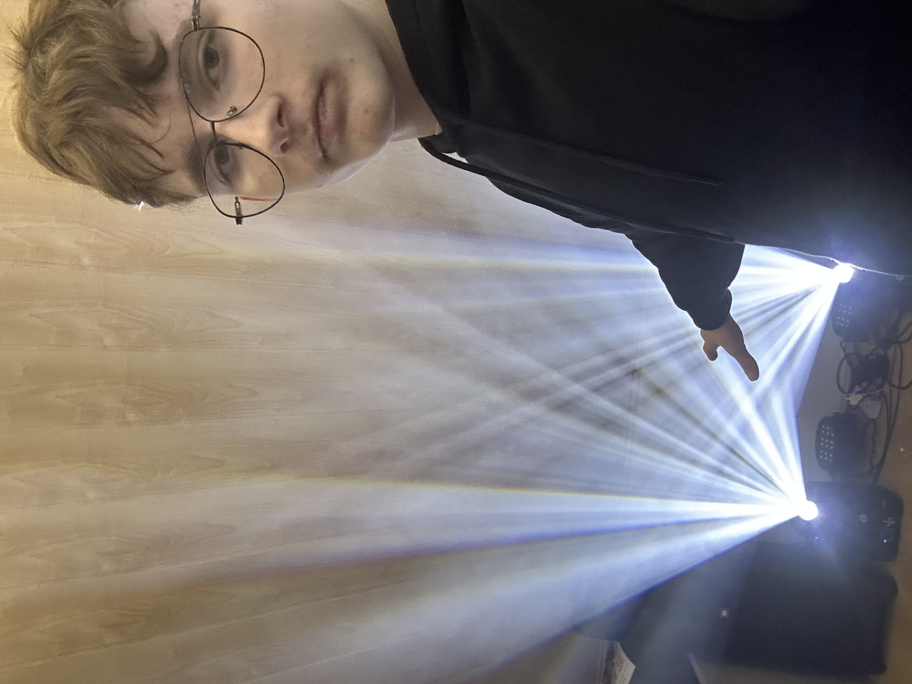
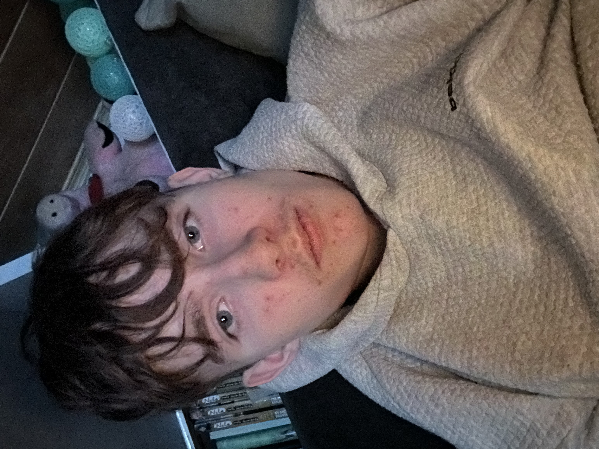

    <!DOCTYPE html>
<html lang="pl">
<head>
    <meta charset="UTF-8">
    <title>Michał &amp; Paulina – Nasza historia</title>
    <meta name="viewport" content="width=device-width, initial-scale=1.0">
    <meta name="description" content="Michał i Paulina – nasza historia, wspomnienia i wyznanie miłości.">
    <link href="https://fonts.googleapis.com/css2?family=Poppins:wght@300;400;500;600;700&family=Great+Vibes&display=swap" rel="stylesheet">

    
</head>
<body>

    

    

    

    

    

    

    

    

    

    

<!-- Podmień nazwę pliku, jeśli Twoja piosenka ma inną -->
<audio id="bg-music" loop>
    <source src="piosenka.mp3" type="audio/mpeg">
    Twoja przeglądarka nie obsługuje odtwarzacza audio.
</audio>

    <button id="music-toggle-btn">
        ♪ Włącz muzykę
        (kliknij, jeśli chcesz)
    </button>

<header>
    

        

            

                Michał &amp; Paulina
                Nasza historia
            

            <nav>
                <ul>
                    <li><a href="#about">O nas</a></li>
                    <li><a href="#timeline">Nasza historia</a></li>
                    <li><a href="#gallery">Galeria</a></li>
                    <li><a href="#reasons">Za co Cię kocham</a></li>
                    <li><a href="#confession">Wyznanie</a></li>
                </ul>
            </nav>
        

    

</header>

<main>

    <!-- POCZĄTEK STRONY -->
    <section class="hero">
        

            

                

                    

                        ♥
                        Dla najważniejszej dziewczyny w moim życiu
                    

                    <h1 class="hero-title">
                        
                            Paulinko,
                        
                        ta strona jest tylko dla Ciebie
                    </h1>
                    

                        Chciałem zrobić coś, co zostanie na dłużej niż jedna wiadomość. Coś,
                        do czego zawsze będziesz mogła wrócić, kiedy tylko będziesz chciała
                        przypomnieć sobie, jak bardzo jesteś dla mnie ważna.
                    

                    

                        

                            

                            Od: 12 grudnia 2024
                        

                        

                            

                            Michał ♥ Paulina
                        

                    

                    

                        <button class="btn-primary" onclick="document.getElementById('about').scrollIntoView({behavior:'smooth'})">
                            Zaczynamy naszą historię
                        </button>
                        

                            Przewiń w dół i zobacz, co dla Ciebie przygotowałem.
                        

                    

                

                

                    

                        <!-- PODMIEŃ NA WASZE ZDJĘCIE -->
                        
                    

                    

                       To jedno z naszych zdjęć na którym jesteśmy 
					   razem i dajemy sobie buzi 
				
                                           
                    

                

            

        

    </section>

    <!-- O NAS -->
    <section id="about">
        

            

                
O nas

                <h2 class="section-title">Jak to wszystko się zaczęło</h2>
                

                    Każda piękna historia ma swój początek. Nasza zaczęła się od zwykłych
                    rozmów, które bardzo szybko stały się czymś, bez czego trudno wyobrazić
                    sobie dzień.
                

            

            

                

                    <h3>Dwoje ludzi, jedna historia</h3>
                    

                        Od momentu, kiedy pojawiłaś się w moim życiu, wszystko zaczęło nabierać
                        innych barw. Nagle zwykłe dni stały się lepsze, a to, co wcześniej było
                        „normalne”, zaczęło mieć większy sens – bo mogłem dzielić to z Tobą.
                    

                    

                        Każda nasza rozmowa, każdy wspólny śmiech, każda wiadomość i spotkanie
                        tylko bardziej utwierdzają mnie w tym, jak bardzo chcę być właśnie
                        z Tobą. To niesamowite, jak jedna osoba potrafi tak dużo zmienić – i
                        właśnie Ty jesteś tą osobą.
                    

                    

                        

                            ♥
                            
Pierwsze rozmowy, które przerodziły się w coś wyjątkowego.

                        

                        

                            ♥
                            
Razem oficjalnie od: 12 grudnia 2024.

                        

                        

                            ♥
                            
Łączy nas coś więcej niż słowa – zrozumienie, bliskość i ciepło.

                        

                        

                            ♥
                            
Najbardziej kocham to, że przy Tobie czuję się po prostu sobą.

                        

                    

                

                

                    <!-- PODMIEŃ NA KOLEJNE ZDJĘCIE -->
                    
                    

                        Jeden z tych momentów, do których zawsze będę chciał wracać.
                    

                

            

        

    </section>

    <!-- NASZA HISTORIA - OŚ CZASU -->
    <section id="timeline">
        

            

                
Nasza historia

                <h2 class="section-title">Najważniejsze momenty</h2>
                

                    Każdy dzień z Tobą jest ważny, ale są takie chwile, które zapisują się
                    w sercu na zawsze. Te kilka to tylko początek tego, co przed nami.
                

            

            

                

                    

                        

                        

                            <strong>Początek naszej historii</strong> 
                            Był taki dzień, kiedy jeszcze nie wiedzieliśmy, dokąd to wszystko
                            nas zaprowadzi. Po prostu rozmawialiśmy, śmialiśmy się, poznawaliśmy
                            się krok po kroku. A jednak już wtedy coś we mnie mówiło, że to
                            będzie ktoś wyjątkowy.
                        

                        

                            Pierwsze rozmowy
                        

                    

                    

                        

                        

                            <strong>Coraz bliżej</strong> 
                            Z każdą kolejną chwilą zaczynałem czuć, że jesteś kimś dużo
                            ważniejszym niż „po prostu” kolejną osobą w moim życiu. Zwykłe
                            wiadomości zaczęły znaczyć więcej, a każde pożegnanie i przywitanie
                             od Ciebie stawało się czymś, na co czekałem.
                        

                        

                            Zakochiwanie się w Tobie
                        

                    

                    

                        

                        

                            <strong>12 grudnia 2024</strong> 
                            Dzień, w którym to wszystko nabrało oficjalnego kształtu. Dzień,
                            od którego mógłbym powiedzieć, że już nie jestem „sam” – że jesteśmy
                            „my”. To data, którą będę pamiętał zawsze, bo od niej zaczyna się
                            nasz wspólny kalendarz.
                        

                        

                            Oficjalnie razem
                        

                    

                    

                        

                        

                            <strong>Przyszłość</strong> 
                            Przed nami jeszcze tyle chwil, których nawet nie jesteśmy w stanie
                            sobie teraz wyobrazić. Wspólne plany, spełnianie marzeń, rozmowy do
                            nocy, spontaniczne wyjścia i zwykłe, spokojne dni – wszystko to, co
                            będzie nasze. I właśnie na to wszystko z Tobą najbardziej czekam.
                        

                        

                            To dopiero początek
                        

                    

                

            

        

    </section>

    <!-- GALERIA -->
    <section id="gallery">
        

            

                
Galeria

                <h2 class="section-title">Chwile zatrzymane na zdjęciach</h2>
                

                    A to cztery moje zdjęcia zrobione w czasie naszego związku   
					 P.S dziękuje za śliczną bluzeczkę 
                    
                    
                

            

            

                

                    <!-- PODMIEŃ ŚCIEŻKI NA SWOJE ZDJĘCIA -->
                    

                        
                    

                    

                        
                    

                    

                        
                    

                    

                        
                    

                

            

        

    </section>

    <!-- ZA CO JĄ KOCHASZ -->
    <section id="reasons">
        

            

                
Za co Cię kocham

                <h2 class="section-title">Małe rzeczy, które znaczą wszystko</h2>
                

                    Mógłbym wymieniać godzinami, ale spróbowałem zebrać choć kilka powodów,
                    dla których tak łatwo jest zakochać się właśnie w Tobie, Paulinko.
                

            

            

                

                    
♥

                    

                        <h3>Twój uśmiech</h3>
                        

                            Twój uśmiech potrafi rozjaśnić nawet najgorszy dzień. Wystarczy,
                            że się uśmiechniesz, a wszystko staje się jakby prostsze, lżejsze
                            i spokojniejsze. To jeden z tych widoków, których nigdy nie mam
                            dość.
                        

                    

                

                

                    
♥

                    

                        <h3>Twoje serce</h3>
                        

                            Kocham to, jaka jesteś dla mnie – wrażliwa, ciepła, troskliwa.
                            Zawsze potrafisz pocieszyć, wesprzeć, powiedzieć coś, co naprawdę
                            pomaga. Masz w sobie tyle dobra, że czasem aż ciężko mi uwierzyć,
                            że mam szczęście być tak blisko tego serca.
                        

                    

                

                

                    
♥

                    

                        <h3>Wspólne chwile</h3>
                        

                            Kocham te wszystkie momenty, kiedy jesteśmy po prostu razem –
                            nawet jeśli nic wielkiego się nie dzieje. Rozmowy, głupie żarty,
                            oglądanie czegoś, pisanie do siebie, planowanie… To właśnie z tych
                            małych rzeczy składa się szczęście.
                        

                    

                

                

                    
♥

                    

                        <h3>To, jaka jesteś</h3>
                        

                            Kocham Cię za to, że jesteś sobą – piękną, mądrą, wyjątkową. Za
                            Twój charakter, emocje, sposób, w jaki patrzysz na świat. Za to,
                            że nie udajesz nikogo innego i dzięki temu przy Tobie ja też
                            nie muszę nic udawać.
                        

                    

                

                

                    
♥

                    

                        <h3>Twoja obecność</h3>
                        

                            Kocham to, że po prostu jesteś. Że mogę napisać, zadzwonić, spotkać
                            się, przytulić. Że nawet w ciszy czuję, że nie jestem sam. Twoja
                            obecność daje mi spokój, którego wcześniej brakowało.
                        

                    

                

                

                    
♥

                    

                        <h3>Nasze „małe rzeczy”</h3>
                        

                            Kocham wszystkie nasze wewnętrzne teksty, głupie żarciki, spojrzenia,
                            które rozumiemy tylko my. Te drobne rzeczy tworzą coś, co jest
                            tylko nasze – i właśnie to czyni tę relację tak wyjątkową.
                        

                    

                

                

                    
♥

                    

                        <h3>To, jak mnie wspierasz</h3>
                        

                            Kocham to, że potrafisz dodać mi siły, kiedy sam w siebie wątpię.
                            Twoje słowa, wsparcie i wiara we mnie naprawdę wiele znaczą. Dzięki
                            Tobie łatwiej mi iść do przodu.
                        

                    

                

                

                    
♥

                    

                        <h3>Twoje poczucie humoru</h3>
                        

                            Kocham to, jak potrafisz mnie rozśmieszyć – czasem jednym zdaniem,
                            spojrzeniem albo głupim żartem. Dzięki Tobie nawet zwykły dzień
                            może stać się wyjątkowy.
                        

                    

                

                

                    
♥

                    

                        <h3>Twoja cierpliwość</h3>
                        

                            Kocham to, że potrafisz mnie zrozumieć, nawet kiedy nie zawsze umiem
                            wszystko dobrze wyjaśnić. Twoja cierpliwość i spokój naprawdę dużo
                            dla mnie znaczą.
                        

                    

                

                

                    
♥

                    

                        <h3>To, jak o mnie dbasz</h3>
                        

                            Kocham wszystkie drobne gesty, przez które widzę, że o mnie dbasz –
                            pytania, czy wszystko w porządku, troskę o mój nastrój, o mój dzień.
                            Czuję się przy Tobie ważny i kochany.
                        

                    

                

            

        

    </section>

    <!-- WYZNANIE -->
    <section id="confession">
        

            

                

                    
Wyznanie

                    <h2 class="section-title">To, co najważniejsze</h2>
                

                

                    

                        Kocham Cię, Paulino
                    

                    

                        Chciałem, żebyś miała miejsce, w którym zawsze będziesz mogła wrócić
                        do tych słów. Kliknij poniżej, a pokażę Ci coś prosto z serca.
                    

                    <button class="btn-outline" id="toggle-letter-btn">
                        Otwórz moje wyznanie
                        ♥
                    </button>

                    

                        

                            Księżniczko,  
                            odkąd pojawiłaś się w moim życiu, wszystko zaczęło wyglądać inaczej.
                            Zwykłe dni przestały być zwykłe, bo wiedziałem, że gdzieś tam po
                            drugiej stronie jesteś Ty – ktoś, z kim chcę dzielić każdą małą i
                            dużą chwilę.
                        

                        

                            Czasem trudno jest ubrać w słowa to, co naprawdę czuję. Ale wiem
                            jedno – jesteś dla mnie kimś niesamowicie ważnym. Kimś, o kogo chcę
                            dbać, kogo chcę wspierać, przy kim chcę być zarówno w tych pięknych,
                            jak i trudniejszych momentach.
                        

                        

                            Dziękuję Ci za to, że jesteś. Za każdy uśmiech, każdą wiadomość,
                            każde „dobranoc” i „dzień dobry”. Za to, że potrafisz sprawić, że
                            czuję się potrzebny i ważny. Za to, że pozwalasz mi być częścią
                            swojego świata.
                        

                        

                            Chcę, żebyś wiedziała, że naprawdę mi na Tobie zależy. Że nie jesteś
                            dla mnie „na chwilę” ani „tak po prostu”. Widzę w Tobie osobę, z którą
                            chcę budować coś prawdziwego – krok po kroku, bez pośpiechu, ale
                            szczerze i z sercem.
                        

                        

                            Kocham Cię, Paulinko. Bardziej, niż jestem w stanie napisać w jednym
                            liście czy na jednej stronie. I mam nadzieję, że z każdym kolejnym
                            dniem będę mógł Ci to udowadniać nie tylko słowami, ale przede
                            wszystkim tym, jak będę przy Tobie.
                        

                        

                            Na zawsze Twój, 
                            Michał (misiu)
                        

                    

                    

                        Dziękuję, że jesteś. Paulino
                    

                

            

        

    </section>

</main>

<footer>
    Stworzone z miłością dla Pauliny. ♥
</footer>

</body>
</html>
